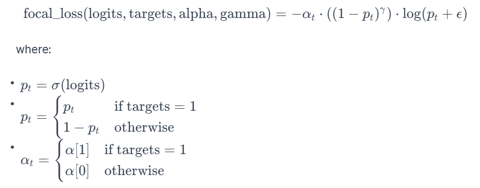
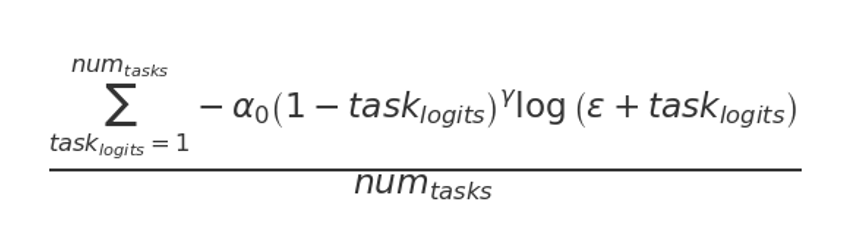
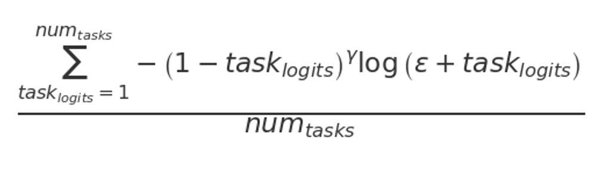

## Integrate lesson plan quality measures and lesson templates into semantic search, recommender systems, nudging chatbot, and multimodal content generation models

### Multi-task Classification version 1:

Multi-task classification involves solving multiple distinct but related classification tasks simultaneously, often with some shared information or representation, but with separate outputs for each task. It is typically used when the tasks are more independent or when different tasks require different types of models or architectures.

Here, I implemented a ModuleList of classifiers (class MultiTaskModel) in a single model, each corresponding to a different binary classification task as opposed to a multi-label classification which uses a single classifier that outputs multiple labels for a single task. Here, each task has its own dedicated classifier, but they all share the same base model (BERT or RoBERTa).

I also defined two custom Loss Functions to handle multiple tasks. These loss functions iterate over each task and calculate a separate loss for each one.

#### Process:

**Libraries**: PyTorch for building neural network models, defining functions, and optimization algorithms; Hugging Face Transformers for text tokenizations and pre-trained LLMs (BERT, RoBERTa); sklearn for training, calculating class wights, and evaluating the performance of the classification model.

1. class LessonPlanDataset: This class initializes the dataset with encodings and target labels and formats the data as PyTorch tensors.

2. Data splitting: The initial split is 80% for training and 20% for testing. The training data is further split to create a validation set, constituting 10% of the entire dataset (0.125 * 0.8 = 0.1).

3. Tokenizer initialization: BertTokenizer.from_pretrained('bert-base-uncased') initializes a tokenizer for the BERT model. This tokenizer converts text data into a format that the BERT-based models can process. I truncated the texts to a maximum length of 128 tokens and converted them into PyTorch tensors.

4. Data loading: Applying tokenization, creating Pytorch tensors, setting up data loaders for the training, validation, and testing datasets. Note: used shuffle true for training-- it ensures that the data is shuffled at every epoch, which helps in reducing overfitting and improving model generalization.

5. Computing class weights to treat imbalanced data: I computed class weights for each feature in label_cols. These weights were computed using the compute_class_weight function from scikit-learn, which is typically used to handle class imbalance by assigning more weight to less frequent classes. The weights are stored in the weights list as PyTorch tensors.

6. Custom Loss Function: 

    1. Standard focal loss: Focal loss is designed to address class imbalance by focusing more on hard-to-classify examples. This function calculates the focal loss for binary classification. basically, it uses the sigmoid function to get the probability of belonging to the positive class, then adjusts the loss based on how far each prediction is from its actual label. Here, I modified the focal loss formula by the alpha parameter to manage class imbalance and the gamma parameter to focus more on hard-to-classify examples.

    

    2. Multi-task focal loss function for training: For this classification task, I extended the standard focal loss to a multi-task scenario, where we have multiple binary classification tasks (num_tasks). It calculates the focal loss for each task separately and then averages the losses over all tasks.

    

       
    3. Focal loss function without class weights: This is a variant of the focal loss that does not use class weights for each task for validation and testing.

    

7. class MultiTaskModel: This class handles multiple binary classification tasks simultaneously. The pre-trained transformer model passed to the class.
num_labels_list: a list containing the number of labels for each task - for binary classification, the number of labels for each task = 2.
I used self.output_transform, a linear layer that transforms the output from the transformer model and self.classifiers, a list of linear layers, each corresponding to a classifier for one of the tasks.
Also, there was a dropout layer for regularization, set to a dropout rate of 0.1.
Forward method defines the forward pass of the model.
input_ids and attention_mask are the inputs to the transformer model.
The transformer's output is obtained and used for classification tasks.
The pooled output is first passed through a dropout layer, then through the output_transform linear layer.
logits are a list of outputs from each classifier in self.classifiers, each applied to the transformed output. These logits are the raw, unnormalized scores that each classifier outputs for its respective task. Since, the quality measures shares overlapping features, this model with a shared feature extractor would be suitable to perform different classification tasks on the same input data. Each task has its own classifier, but all classifiers share the same base representations provided by the transformer.

8. class CustomAttention: I defined a custom attention mechanism to focus on important text components. It computes a set of attention scores for the input features, and these scores are then used to create a weighted sum of the features. The resulting weighted features can be seen as a context vector that captures the most important information (like certain words in a sentence) from the input. I applied a tanh activation function to the output of self.attention_layer(features). This non-linear transformation helps in capturing complex relationships in the data. Then I applied a softmax function to the output of self.context_vector. The softmax is computed along the first dimension (dim=1), ensuring that the attention scores across the features sum up to 1, thus forming a valid probability distribution. Finally, I calculated the weighted sum of the input features, weighted by the attention scores resulting a single vector that is a summary of the input features, with more important features having a higher influence on the summary vector.

9. Initializing transformer models: BERT and ROBERTa. Combining these two, I created the custom attention model class instance. Therefore, here, the two transformer models (BERT and RoBERTa) is processing the same input and generating predictions for multiple binary classification tasks. Then the custom attention model is used to fuse the information from both transformer models for each task, potentially enhancing the model's ability to focus on more relevant features from each transformer's output.

10. make_ensemble_predictions_with_attention(): It is designed to make ensemble predictions using both the BERT and RoBERTa multi-task models, along with the custom attention mechanism. The function iterates through logits for each task from both models. For each task, it concatenates the logits from both models into concatenated_logits. This creates a combined representation of the predictions from both BERT and RoBERTa for each task. The attention_model is then applied to these concatenated logits. The outputs for all tasks (all_attention_outputs) are then stacked and reshaped to form final_output. Therefore, the final output of the function is final_output, which represents the ensemble predictions for all tasks, after considering both BERT and RoBERTa's logits and applying the custom attention mechanism.

11. find_lr(): It is a learning rate finder to find a good initial learning rate for training a neural network. 
This portion of your code sets up the optimizer, learning rate scheduler, and early stopping criteria for training the ensemble model consisting of BERT, RoBERTa, and the custom attention model.

12. Model parameters: 
batch_size = 32, 64: In each iteration of training or evaluation, the model will process 64 examples at a time.
learning_rate = 1e-3: This sets the initial learning rate for the optimizer.
Adam Optimizer: Initialized with parameters from all three models
Cyclic Learning Rate Scheduler: CyclicLR: This is a learning rate scheduler that varies the learning rate between a base and a upper bound. This is helpful for both faster convergence and better generalization.
base_lr = 1e-6 and max_lr = 10 ** -3.5 set the lower and upper bounds for the learning rate.
cycle_momentum = False: Indicates not to vary the momentum with the learning rate.
step_size_up=5\*len(train_loader): This defines how many iterations it will take to go from the base learning rate to the max learning rate. The choice of 5*len(train_loader) means the learning rate will increase over 5 epochs (assuming each epoch has len(train_loader) iterations).
Early Stopping Criteria: 
best_val_loss = float('inf'): Initializes the best validation loss to infinity.
patience_counter = 0: A counter to track how many epochs have been trained without improvement in validation loss.
early_stopping_patience = 6: The number of epochs to wait for an improvement in validation loss before stopping the training.
num_epochs = 40: The maximum number of epochs for training.
The early stopping mechanism is a regularization technique to prevent overfitting. If the validation loss does not improve for a consecutive number of epochs, the training process will be halted.
The predictions are obtained by applying a sigmoid function to the model outputs and thresholding at 0.5 to get binary predictions.
Both predictions and labels are stored for all batches.
The torch.no_grad() context manager is used to disable gradient calculations, reducing memory consumption and speeding up computations.